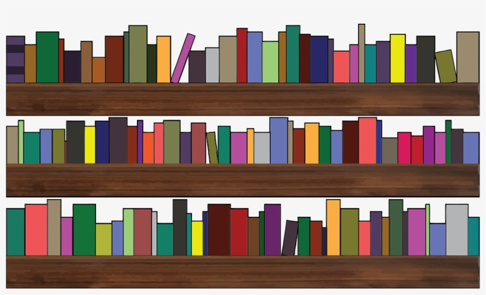

## About Bibble

Bibble is a simple and intuitive web application for use in a lending library. It allows for
multiple copies of the same book and features a simple check-in/check-out page. It includes
a facility for printing borrower and book barcodes.

## License

Bibble is open-sourced software licensed under the [GPLv3 license](https://www.gnu.org/licenses/gpl-3.0.html).